# Financial Assistant

## Описание проекта:
Чат-бот для анализа личных финансов в Telegram

## Цель проекта: 
Создание удобного и интерактивного чат-бота для анализа личных финансов, который помогает пользователям управлять своими доходами и расходами, а также прогнозирует будущие расходы и дает рекомендации по их оптимизации.

## Как запустить:
[Запустить бота в Telegram](https://web.telegram.org/k/#@vm_smartcash_bot)

## Как взаимодействовать:
Сперва пользователь загружает файл со своими денежными операциями, затем общается с ботом посредством кнопок и естественного языка для получения необходимой информации.

## Основные функции:
- **Анализ финансовых данных**: Пользователь загружает выгрузку своих банковских операций в формате CSV, после чего бот анализирует данные и предоставляет визуализацию расходов и доходов по различным категориям.
- **Финансовые советы**: Бот предлагает рекомендации по оптимизации расходов на основе анализа данных, помогая пользователю более эффективно управлять своими финансами. Бот может рассказать о специальных предложениях, например, Т-банка, которые помогут пользователю сэкономить его средства.
- **Прогнозирование расходов**: Используя модели машинного обучения, бот прогнозирует будущие расходы на основе исторических данных. Пользователь может выбрать период для предсказания.
- **Распознавание дат и периодов**: Бот использует методы обработки естественного языка (NLP) для распознавания и интерпретации различных форматов дат и временных промежутков, включая последние месяцы, годы, сезоны и конкретные периоды.

## Технологии и библиотеки:
- **Python** — основной язык программирования.
- **Telegram Bot API** — для взаимодействия с пользователями через Telegram.
- **Pandas** — для обработки и анализа финансовых данных.
- **Matplotlib/Seaborn** — для визуализации данных.
- **Dateparser и Regex** — для обработки пользовательского ввода дат и распознавания шаблонов.
- **asyncio** — для асинхронного выполнения задач.
- **Machine Learning (ML)** - модели машинного обучения используются для прогнозирования расходов на основе исторических данных пользователя (конкретнее: ARIMA и SARIMAX).
- **Natural Language Processing (NLP)** - NLP методы применяются для распознавания и интерпретации вводимых пользователем дат и периодов.

## Логика работы:
1. При первом запуске бот приветствует пользователя и предлагает загрузить CSV-файл с финансовыми операциями.
2. После загрузки файла бот анализирует данные и предлагает пользователю выбрать дальнейшие действия: анализ расходов за определенный период, получение советов по экономии или прогнозирование будущих расходов с использованием МО.
3. Бот поддерживает обработку текстовых команд и взаимодействие через кнопки, что делает его удобным и простым в использовании.

## Преимущества:
- Интуитивно понятный интерфейс, который не требует от пользователя технических знаний.
- Возможность персонализированного анализа финансов.
- Использование машинного обучения для более точного прогнозирования будущих расходов.
- Визуализация данных, что помогает пользователю лучше понять свои финансовые привычки.
- Расширенные возможности NLP для точного распознавания временных интервалов.

## Перспективы развития:
- Расширение возможностей аналитики с учетом различных типов доходов и расходов.
- Добавление интеграции с банковскими API для автоматической загрузки данных.
- Улучшение моделей МО для более точных прогнозов и адаптации к изменениям в поведении пользователей.
- Переход к полному общению на естественном языке.

## **Скриншоты работы**

Нажмите, чтобы развернуть

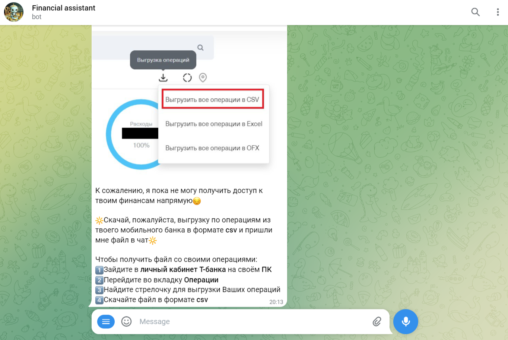

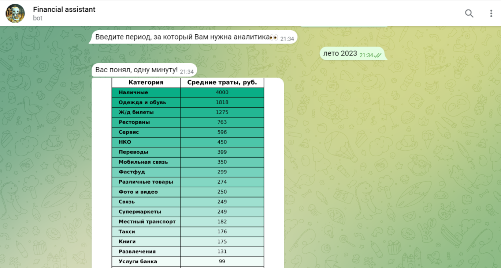
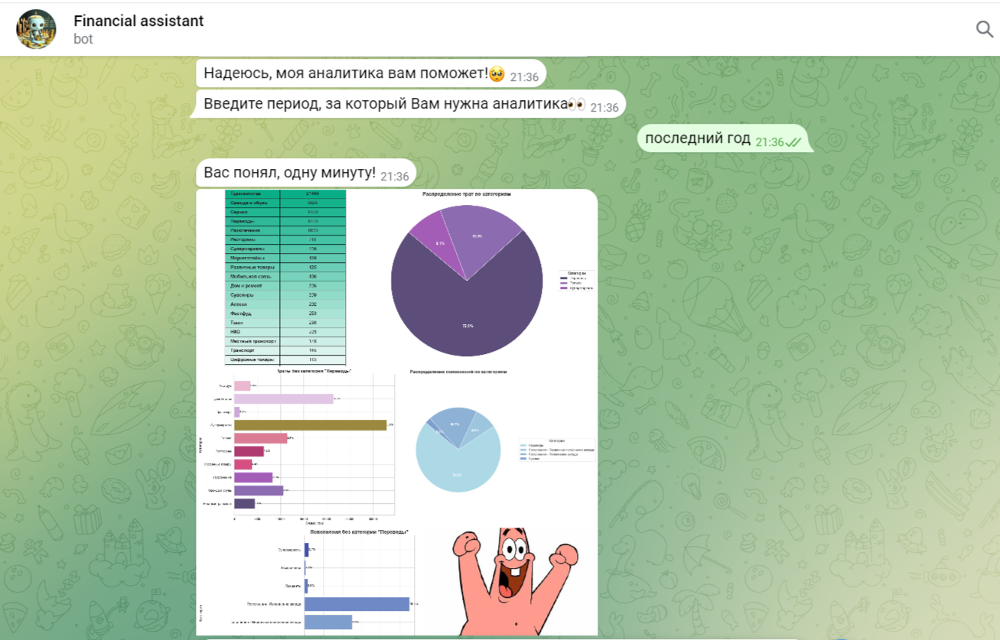
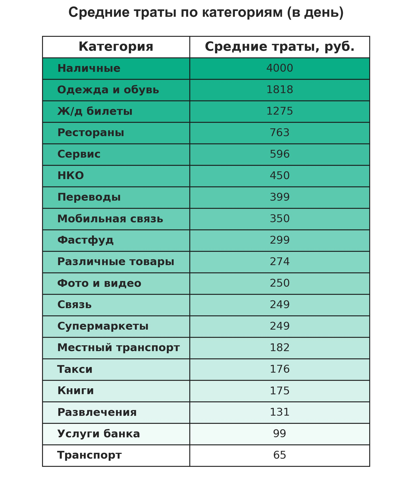
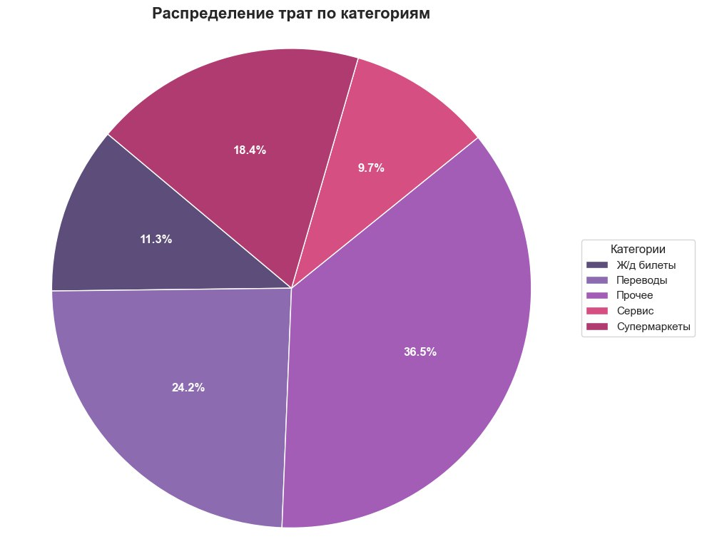
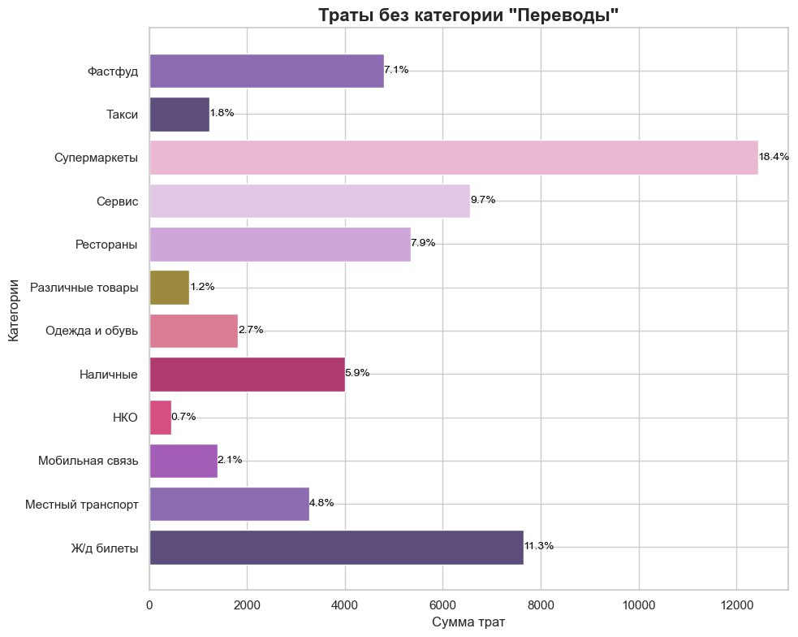
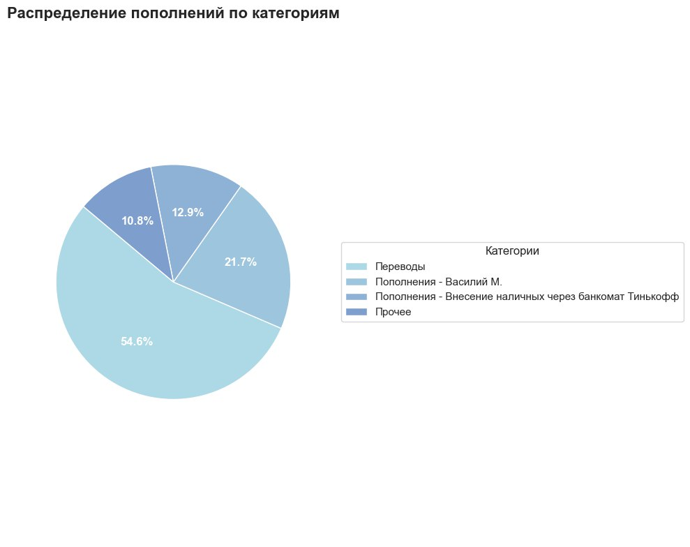
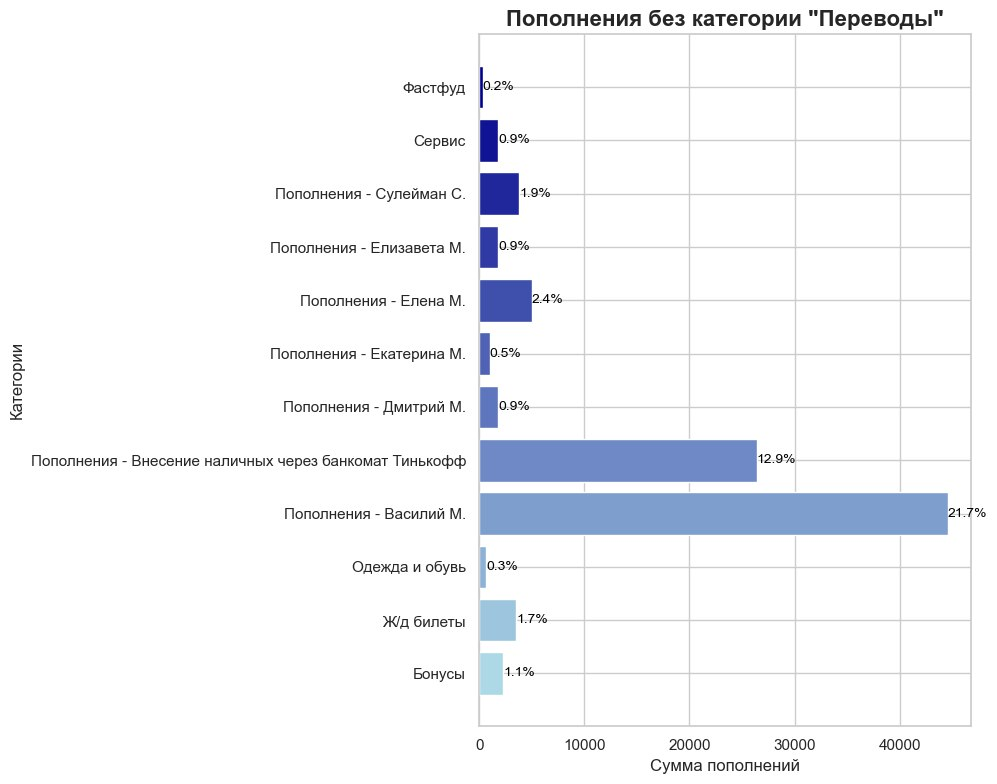

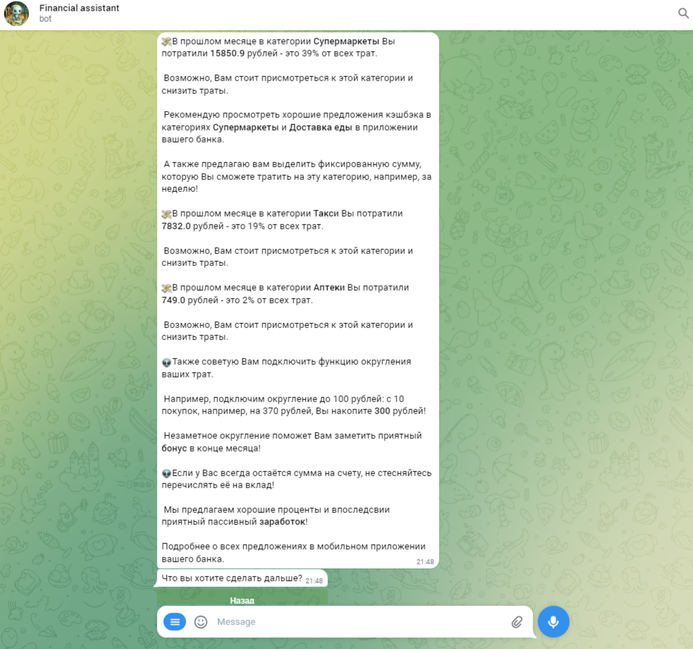
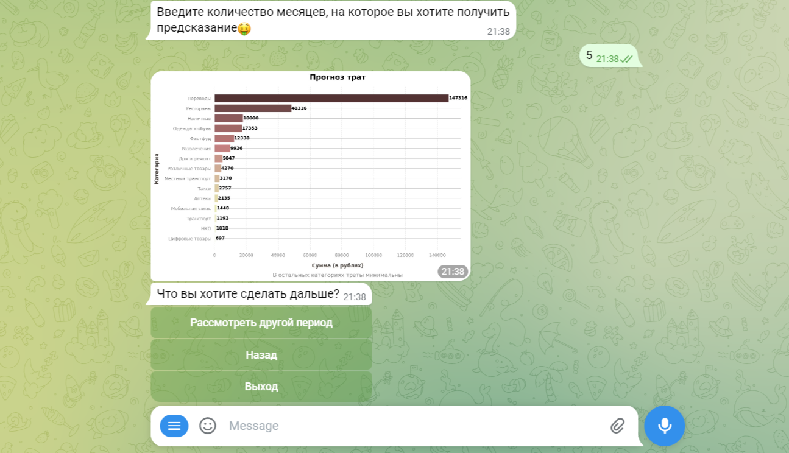
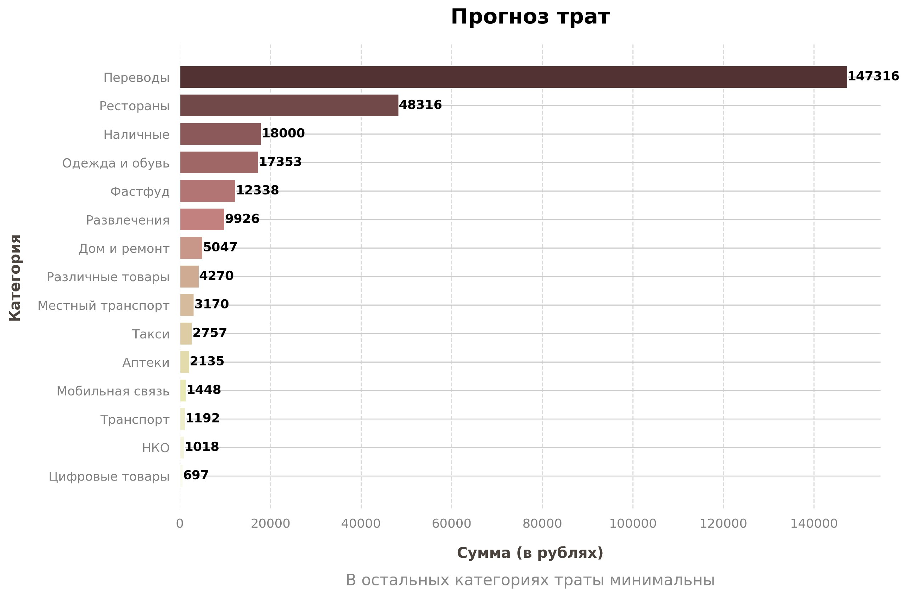

